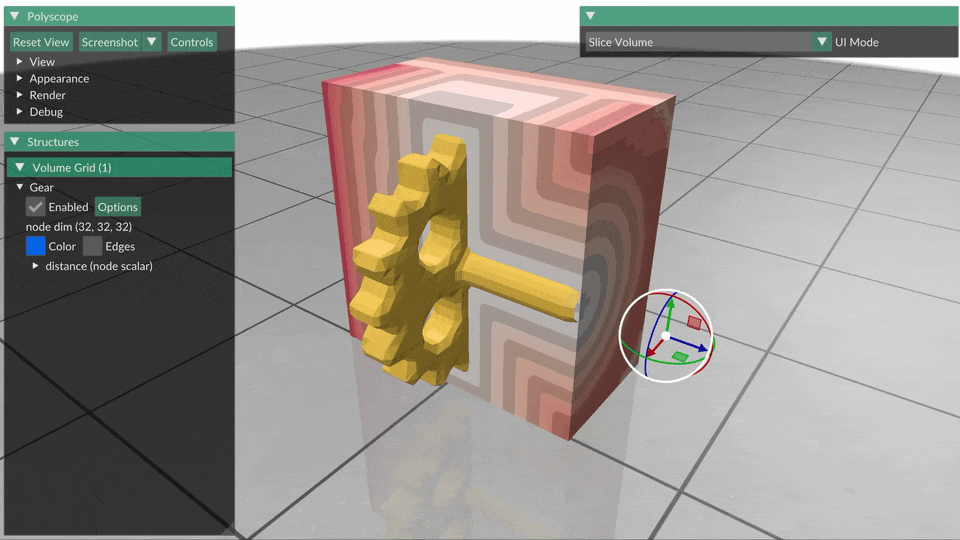

# Conservative SDF



A C++ library (plus optional visualizer) of closed-form conservative signed distance functions (SDFs).  **Conservative** means that the values φ provided at each point are guaranteed to be _no greater_ than the true distance to the shape boundary (Lipschitz constant no greater than 1).  Equivalently, an ball of radius φ will be empty, i.e., it will not intersect the surface.

Examples were ported from GLSL shader code in the [sdf-explorer](https://github.com/tovacinni/sdf-explorer) project, which collected a variety of signed distance functions from [Shadertoy](https://www.shadertoy.com/) and [Inigo Quilez's articles](https://iquilezles.org/articles/distfunctions/)).  SDFs span several categories:

- **Geometry**: Primitives like spheres, cubes, tori, and polyhedra
- **Fractals**: Mandelbulb, Menger sponge, Julia sets, Sierpinski tetrahedron
- **Animals**: Fish, and other organic forms
- **Manufactured objects**: Teapots, gears, and mechanical parts
- **Miscellaneous**: Food items, abstract shapes, and more

## Installation & Building

### Prerequisites
- CMake 3.16+
- C++17 compatible compiler
- Internet connection (for fetching Polyscope during build)

### Build Steps

```bash
git clone <this-repo>
git submodule update --init --recursive
cd conservative-sdf
mkdir build && cd build
cmake ..
make -j8
```

This builds:
- `libsdf_lib.a` — Static library containing all SDFs
- `sdf_viewer` — Polyscope-based visualization tool

## API Usage

### Minimal Example

```cpp
#include <iostream>
#include "sdf/sdf.hpp"

int main() {
    // Query the sphere SDF at the origin
    float d = sdf::evaluate("Sphere", glm::vec3(0.0f, 0.0f, 0.0f));
    std::cout << "Distance at origin: " << d << std::endl;  // -0.5 (inside)

    // Query at the surface
    d = sdf::evaluate("Sphere", glm::vec3(0.5f, 0.0f, 0.0f));
    std::cout << "Distance at surface: " << d << std::endl;  // ~0.0

    // Query outside
    d = sdf::evaluate("Sphere", glm::vec3(1.0f, 0.0f, 0.0f));
    std::cout << "Distance outside: " << d << std::endl;  // 0.5

    return 0;
}
```

### Batch Evaluation

```cpp
#include "sdf/sdf.hpp"
#include <vector>

// Create a grid of query points
std::vector<glm::vec3> points;
for (int z = 0; z < 32; ++z) {
    for (int y = 0; y < 32; ++y) {
        for (int x = 0; x < 32; ++x) {
            float px = -1.0f + 2.0f * x / 31.0f;
            float py = -1.0f + 2.0f * y / 31.0f;
            float pz = -1.0f + 2.0f * z / 31.0f;
            points.emplace_back(px, py, pz);
        }
    }
}

// Evaluate the Mandelbulb SDF at all points
std::vector<float> distances = sdf::evaluate("Mandelbulb", points);
```

### Time-Varying SDFs

Some SDFs (like Fish) support animation via a time parameter:

```cpp
// Evaluate at t=0
auto d0 = sdf::evaluate("Fish", points, /*time=*/0.0f);

// Evaluate at t=1.5 seconds
auto d1 = sdf::evaluate("Fish", points, /*time=*/1.5f);
```

### Listing Available SDFs

```cpp
#include "sdf/sdf.hpp"
#include <iostream>

for (const auto& name : sdf::getAvailableSDFs()) {
    std::cout << name << std::endl;
}
```

### Linking Against the Library

In your CMakeLists.txt:

```cmake
add_subdirectory(path/to/conservative-sdf)
target_link_libraries(your_target PRIVATE sdf_lib)
```

## Polyscope Visualizer

The included `sdf_viewer` tool visualizes SDFs using [Polyscope](https://polyscope.run/), sampling the SDF on a regular 3D grid and displaying the result as a volume.

### Basic Usage

```bash
# List all available SDFs
./sdf_viewer --list

# Visualize a sphere
./sdf_viewer Sphere

# Visualize with higher resolution
./sdf_viewer Mandelbulb --resolution 64

# Animate the fish at t=1.5
./sdf_viewer Fish --time 1.5
```

### Command Line Options

| Option | Description |
|--------|-------------|
| `--resolution N`, `-r N` | Grid resolution per axis (default: 32) |
| `--time T`, `-t T` | Time parameter for animated SDFs (default: 0.0) |
| `--seed S`, `-s S` | Random seed for procedural SDFs (default: 12345) |
| `--list`, `-l` | List all available SDFs |
| `--help`, `-h` | Show help message |

### Using Slice Planes in Polyscope

Slice planes are invaluable for inspecting the interior of 3D SDF fields. Here's how to use them:

1. **Add a Slice Plane**: In the Polyscope GUI, go to the left panel and click **[Add] → Slice Plane**

2. **Position the Plane**: 
   - Click and drag the plane's center handle to translate it
   - Click and drag the arrow to rotate the plane normal
   - Or use the GUI controls to set exact position/orientation

3. **Inspect the Volume**:
   - The slice plane will cut through the volume grid, revealing the SDF values on that cross-section
   - Negative values (inside the surface) appear in one color range
   - Positive values (outside) appear in another
   - The zero-crossing shows the exact surface location

4. **Multiple Planes**: Add multiple slice planes to view orthogonal cross-sections simultaneously

### Isosurface Extraction

The viewer automatically enables isosurface extraction at distance = 0, showing the reconstructed surface. You can adjust this in the GUI:

1. Select the volume grid in the structure list
2. Expand the "distance" scalar quantity
3. Adjust the **Isosurface Level** slider to see level sets at different distances
4. Toggle **Isosurface** checkbox to show/hide

## Available SDFs

### Geometry (19)
Bezier, Capsule, Cone, Cube, Cylinder, Dodecahedron, Helix, Hexprism, Icosahedron, Octabound, Octahedron, Pyramid, Roundbox, Sphere, Tetrahedron, Torus, Trefoil, Triangle, Triprismbound

### Fractals (4)
Julia, Mandelbulb, Menger, Serpinski

### Animals (12)
Dinosaur, Elephant, Fish, Girl, HumanHead, HumanSkull, Jellyfish, MantaRay, PixarMike, Snail, Snake, Tardigrade

### Nature (4)
Mountain, Mushroom, Rock, Tree

### Manufactured (15)
Cables, Castle, Chain, Gear, GrandPiano, Key, Knob, Mech, Mobius, Rooks, Spike, Teapot, Temple, UprightPiano, Vase

### Vehicle (6)
Boat, Cybertruck, Jetfighter, Lamborghini, Oldcar, TieFighter

### Miscellaneous (3)
Burger, Cheese, Dalek

## Adding New SDFs

To add a new SDF from the original GLSL collection:

1. Create a new header file in `include/sdf/<Category>/<Name>.hpp`
2. Translate the GLSL to C++ using the patterns in `common.hpp`
3. Wrap the main `sdf()` function with the standard signature:
   ```cpp
   inline float Name(const vec3& p, float time, uint32_t seed) { ... }
   ```
4. Include the header in `src/sdf.cpp`
5. Add an entry to the `g_registry` map

## GLSL to C++ Conversion

The original GLSL SDFs were translated to C++ using [GLM](https://github.com/g-truc/glm) (OpenGL Mathematics), a header-only library that mirrors GLSL's vector and matrix types.

### Key Translation Patterns

| GLSL | C++ (with GLM) |
|------|----------------|
| `vec3 p` | `glm::vec3 p` |
| `length(p)` | `glm::length(p)` |
| `normalize(v)` | `glm::normalize(v)` |
| `dot(a, b)` | `glm::dot(a, b)` |
| `mix(a, b, t)` | `glm::mix(a, b, t)` |
| `clamp(x, lo, hi)` | `glm::clamp(x, lo, hi)` |
| `smoothstep(e0, e1, x)` | `glm::smoothstep(e0, e1, x)` |
| `p.xz` (swizzle) | `glm::vec2(p.x, p.z)` or use GLM's experimental swizzle |
| `mod(x, y)` | Custom `mod()` function (GLSL-style modulo) |
| `fract(x)` | Custom `fract()` function |

The library provides a `common.hpp` header with these utility functions and type aliases, making the translated code closely resemble the original GLSL.


## License

The SDF implementations are derived from various sources with different licenses:
- Many are from Inigo Quilez (MIT License)
- Some are from Shadertoy (CC BY-NC-SA 3.0)
- See individual header files for specific attribution

The library infrastructure (build system, API, common utilities) is provided under the MIT License.

## Acknowledgments

- [Inigo Quilez](https://iquilezles.org/) for the foundational SDF work
- [sdf-explorer](https://github.com/tovacinni/sdf-explorer) project for collecting these examples
- [Polyscope](https://polyscope.run/) for the visualization framework
- [GLM](https://github.com/g-truc/glm) for the mathematics library

